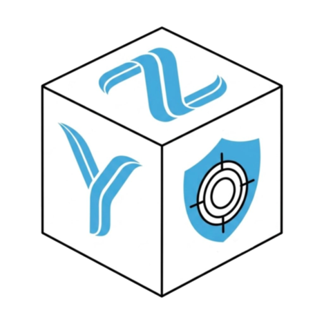
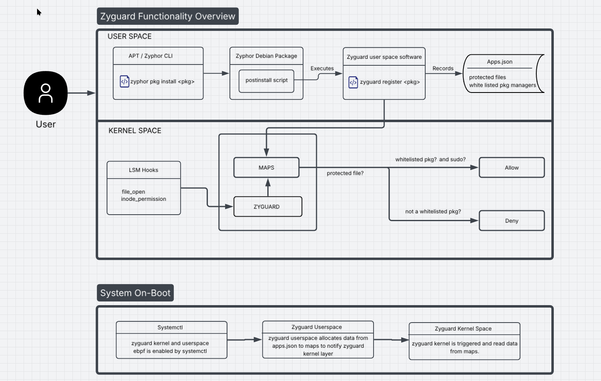

 </a>

<h3 align="center">Z Y G U A R D</h3>

Protector of Zyphor os Ecosystem.

## Table of Contents

- [ The purpose of Zyguard ](#purpose)
- [ Architecture ](#arch)
- [ How it works ](#templates)
- [ In-depth Technical analysis ](#art)
  - [Novice Technical Writers](https://www.writethedocs.org/guide/#new-to-caring-about-documentation)
  - [Experienced Technical Writers](https://www.writethedocs.org/guide/#experienced-documentarian)
  - [API Documentation](https://www.writethedocs.org/guide/#api-documentation)
  - [Adding badges](https://github.com/badges/shields/blob/master/README.md#examples)
  - [Tools](https://www.writethedocs.org/guide/#tools-of-the-trade)
- [Acknowledgements](#acknowledgements)

## The Purpose of Zyguard 

- Zyguard is a BPF program designed to protect Zyphos OS native packages from unauthorized modification by malicious software. A core goal of Zyphos OS is reducing user friction during multi-step tasks—such as using a single zyphor CLI instead of juggling multiple package managers. Because these native packages are not yet fully battle-tested, Zyguard acts as a safety net by restricting unauthorized access to keep the system secure.

## Architecture 

**Things you should avoid:**

- Don't assume prior knowledge about the topic. If you want to appeal to a large audience, then you are going to have people with very diverse backgrounds
- Don't use idioms. Write using more formal terms that are well defined. This makes it easier for non-native English speakers and for translations to be written
- Don't clutter explanations with overly detailed examples
- Don't use terms that are offensive to any group. There will never be a good reason to

## Templates 

- [README](/en/README_TEMPLATES)
- [Pull Request](/en/PULL_REQUEST_TEMPLATE.md)
- [Issues](/en/ISSUE_TEMPLATES)
- [Contributing](/en/CONTRIBUTING.md)
- [Code of Conduct](/en/CODE_OF_CONDUCT.md)
- [Coding Guidelines](/en/CODING_GUIDELINES.md)
- [Codebase Structure](/en/CODEBASE_STRUCTURE.md)
- [Changelog](/en/CHANGELOG.md)
- [TODO](/en/TODO.md)

## The Art of Technical Writing 

Further reading on technical writing topics from [www.writethedocs.org](https://www.writethedocs.org)

- [Novice Technical Writers](https://www.writethedocs.org/guide/#new-to-caring-about-documentation)
- [Experienced Technical Writers](https://www.writethedocs.org/guide/#experienced-documentarian)
- [API Documentation](https://www.writethedocs.org/guide/#api-documentation)
- [Adding badges](https://github.com/badges/shields/blob/master/README.md#examples)
- [Tools](https://www.writethedocs.org/guide/#tools-of-the-trade)

## Technical Writing Programs 

1. [Google Season of Docs](https://developers.google.com/season-of-docs/)
2. [A List of Open Source Projects with Volunteer Documentation Opportunities](https://www.reddit.com/r/technicalwriting/comments/800a9a/a_list_of_open_source_projects_with_volunteer/)

## Awesome Technical Writing Sources 

1. [r/technicalwriting](https://www.reddit.com/r/technicalwriting/)
2. [My Tech Writing Process](https://amrutaranade.com/2018/03/07/my-writing-process/) - Amruta Ranade
3. [Developer to Technical Writer](https://www.reddit.com/r/technicalwriting/comments/a1x6c8/) - r/technicalwriting
4. [awesome-github-templates](https://github.com/devspace/awesome-github-templates) - devspace
5. [makeareadme](https://www.makeareadme.com/) - dguo
6. [What nobody tells you about documentation](https://www.divio.com/blog/documentation/) - Daniele Procida
7. [3 Essential Components of Great Documentation](https://dev.to/eli/3-essential-components-of-great-documentation-2cih) - Eli B
8. [Inspiring techies to become great writers](http://cameronshorter.blogspot.com/2019/02/inspiring-techies-to-become-great.html) - Cameron Shorter
9. [Technical Documentation Writing Principles](http://cameronshorter.blogspot.com/2018/06/technical-documentation-writing.html) - Cameron Shorter
10. [Building Our Documentation Site on platformOS — Part 2: Content Production and Layouts](https://www.platformos.com/blog/post/blog/building-our-documentation-site-on-platformos-part-2-content-production-and-layouts) - Diana Lakato
11. [Google Developer Documentation Style Guide](https://developers.google.com/style/) - Google
12. [README Maturity Model](https://github.com/LappleApple/feedmereadmes/blob/master/README-maturity-model.md) - LappleApple
13. [Markdown Style Guide](http://www.cirosantilli.com/markdown-style-guide/) - Ciro Santilli

## Get Feedback 

- [feedmereadmes](https://github.com/LappleApple/feedmereadmes) - Free README editing + feedback to make your open-source projects grow. See the README maturity model to help you keep going
- [maintainer.io](https://maintainer.io/) - Free README standardization and feedback if you click on 'Book an audit'

## Acknowledgements 

1. [Documenting your projects on GitHub](https://guides.github.com/features/wikis/) - GitHub Guides
2. [documentation-handbook](https://github.com/jamiebuilds/documentation-handbook) - jamiebuilds
3. [Documentation Guide](https://www.writethedocs.org/guide/) - Write the Docs

## P.S. 

- This repo is under active development. If you have any improvements / suggestions please file an [issue](https://github.com/race2infinity/The-Documentation-Compendium/issues/new/choose) or send in a [Pull Request](/en/CONTRIBUTING.md)
- The [issues](https://github.com/race2infinity/The-Documentation-Compendium/issues) page is a good place to visit if you want to pick up some task. It has a list of things that are to be implemented in the near future

  
   
  To the extent possible under law,
  <a rel="dct:publisher"
     href="https://github.com/race2infinity/">
    Kyle Lobo</a>
  has waived all copyright and related or neighboring rights to
  The Documentation Compendium.

